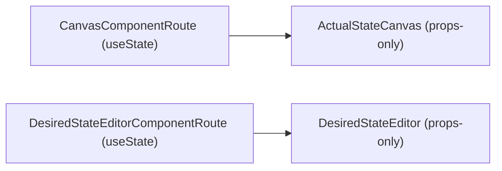
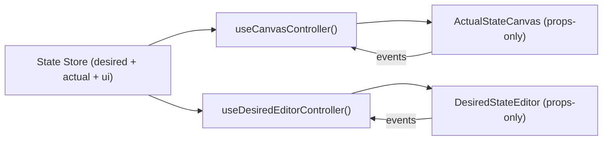
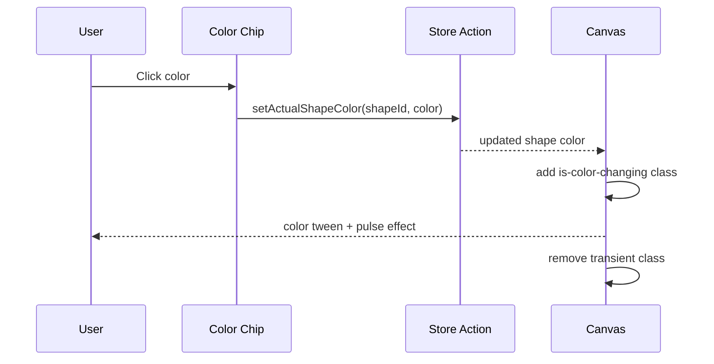
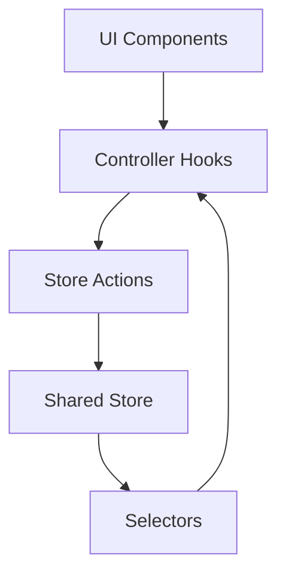

# Actual State Canvas Evolution Plan

## Scope
This plan covers three requested changes:
- Add a cool color-change animation when a color chip is clicked in `ActualStateCanvas`.
- Refactor the app so presentational components remain hook-free and hook logic lives in external state/controller hooks.
- Introduce lightweight shared state management so both `desiredState` and `actualState` updates flow through one store.

## Current Baseline (Observed)
- `ActualStateCanvas` is already presentational and props-driven:
  - `app/src/components/ActualStateCanvas.tsx`
- `DesiredStateEditor` is also presentational and props-driven:
  - `app/src/components/DesiredStateEditor.tsx`
- Local hook state currently lives in route previews:
  - `app/src/routes/CanvasComponentRoute.tsx`
  - `app/src/routes/DesiredStateEditorComponentRoute.tsx`
- Existing CSS already contains selection and palette reveal animations:
  - `app/src/index.css`

## Feasibility Summary
- Color-change animation: `High` feasibility, low risk, can be done purely in CSS + a small transient class/state trigger.
- Hook-outside-component approach: `High` feasibility; architecture already close to this model.
- Lightweight shared state: `High` feasibility with moderate migration effort; recommend Zustand or Jotai.

## Recommended Direction
1. Keep visual components pure and props-only.
2. Add an app-level UI/domain store for desired/actual state, selection, and actions.
3. Expose state and commands via dedicated hooks in `app/src/state/` and `app/src/features/.../hooks/`.
4. Wire routes/composed screens to those hooks; pass only plain props to components.

## Architecture: Current vs Target




## Color Animation Plan
Goal: clicking a color chip should visibly animate the selected shape’s color transition.

### Option A (Recommended): CSS variable transition + pulse ring
- Store shape color in CSS variable (`--shape-color`) on shape shell/glyph wrapper.
- On color change:
  - update color value
  - apply transient class like `.is-color-changing` for ~300-450ms
- Animation:
  - smooth color tween (`transition: color 240ms ...`)
  - subtle ring burst (`::after` keyframes) and optional slight scale bounce
- Respect reduced motion using existing `prefers-reduced-motion` guard.

### Option B: Web Animations API
- Trigger `element.animate(...)` for each color change.
- Pros: tighter control and keyframe orchestration.
- Cons: more imperative logic and testing overhead.

### Proposed Interaction Sequence


## Hook Refactor Strategy (All Components)
Interpretation used for this plan:
- "All hook logic outside component definition" means no domain state hooks (`useState`, `useReducer`, effects for business rules) in presentational components.
- Controlled hooks may still be used in controller hooks and composition layers (route/page/container level).

### Guidelines
- `components/`: render-only, no domain hooks.
- `features/**/hooks/`: logic hooks that map store -> view model + handlers.
- `state/`: store, selectors, action creators.
- `routes/`: compose controllers + presentational components.

### Proposed File Skeleton
```text
app/src/state/
  appStore.ts
  selectors.ts
  actions/
    desiredActions.ts
    actualActions.ts
    uiActions.ts

app/src/features/canvas/hooks/
  useCanvasController.ts

app/src/features/desired-state/hooks/
  useDesiredEditorController.ts
```

## State Management Plan
State domains:
- `desiredState: Shape[]`
- `actualState: Shape[]`
- `ui: { selectedActualShapeId?: string; isReconcilerRunning: boolean; ... }`

Actions (examples):
- `selectActualShape(shapeId | undefined)`
- `setActualShapeColor(shapeId, color)`
- `deleteActualShape(shapeId)`
- `addDesiredShape(shape)`
- `updateDesiredShapeType(shapeId, type)`
- `updateDesiredShapeColor(shapeId, color)`
- `removeDesiredShape(shapeId)`
- `reconcileStep()` (future phase)

### Data Flow (Target)


## Migration Phases
1. Phase 1: Introduce store with current sample data and mirrored route behavior.
2. Phase 2: Add controller hooks and rewire both preview routes.
3. Phase 3: Add color-change animation trigger path.
4. Phase 4: Centralize shared shape/domain types out of component files.
5. Phase 5: Wire reconciliation actions/events into same store (as planned in docs).

## Risks and Mitigations
- Over-centralizing transient UI state:
  - Keep truly local ephemeral UI (purely visual toggles) local when not cross-component.
- Re-render overhead from global store:
  - Use selectors and shallow compare to subscribe to minimal slices.
- Animation regressions:
  - Add reduced-motion fallback and test quick repeated color clicks.

## Validation Checklist
- Selecting a color animates the target shape consistently.
- `ActualStateCanvas` and `DesiredStateEditor` remain props-only.
- Routes stop owning business state via local `useState`.
- Editing desired/actual state updates shared state and is reflected across dependent components.
- Existing interaction behavior remains intact (selection, clear selection, delete).

## Open Decisions
- Pick store library (see options matrix doc).
- Decide whether selection state is global or route-scoped.
- Decide if color animation should restart on repeated same-color clicks.
