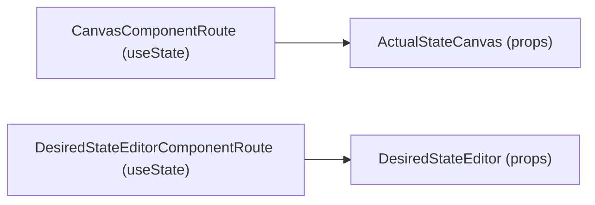
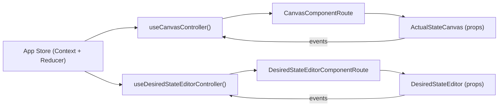
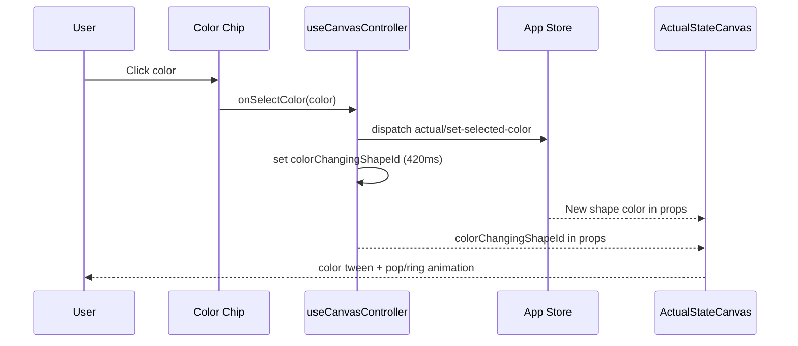

# Implementation Update: Before vs After

## Summary
This document captures the implemented changes for:
- Canvas color-change animation on color-picker click.
- Hook logic moved out of presentational components.
- Lightweight shared state management for desired and actual state flows.

## What Was Implemented

### 1. Shared State Management
- Added a lightweight app store using `Context + useReducer`.
- Centralized these state domains:
  - `desiredState`
  - `actualState`
  - `selectedActualShapeId`
- Added actions for:
  - selecting/clearing selected actual shape
  - deleting selected actual shape
  - changing selected actual shape color
  - add/remove/update desired shapes

### 2. Hook Logic Extraction
- Presentational components remain props-driven:
  - `ActualStateCanvas`
  - `DesiredStateEditor`
- Moved domain logic into controller hooks:
  - `useCanvasController`
  - `useDesiredStateEditorController`
- Routes now compose controller hooks + UI components.

### 3. Color-Change Animation
- Added transient color-change behavior:
  - Controller sets `colorChangingShapeId` when color is picked.
  - Canvas marks that shape with `is-color-changing`.
- Added CSS animation:
  - color tween on shell
  - short pop + ring burst effect
  - `prefers-reduced-motion` fallback

## Before vs After Architecture

### Before

### After

## Color Change Interaction (After)

## File-Level Change Map

### New Files
- `app/src/state/types.ts`
- `app/src/state/appStoreContext.ts`
- `app/src/state/AppStateProvider.tsx`
- `app/src/state/useAppStore.ts`
- `app/src/features/canvas/hooks/useCanvasController.ts`
- `app/src/features/desired-state/hooks/useDesiredStateEditorController.ts`

### Updated Files
- `app/src/App.tsx`
- `app/src/routes/CanvasComponentRoute.tsx`
- `app/src/routes/DesiredStateEditorComponentRoute.tsx`
- `app/src/components/ActualStateCanvas.tsx`
- `app/src/index.css`

## Before vs After: State Ownership

### Before
- Route-local state via `useState`.
- No shared store between canvas and desired editor routes.
- Color picker callback was stubbed (`noop`) in canvas preview.

### After
- Central shared app state via reducer store.
- Route handlers backed by controller hooks and store dispatch.
- Color picker updates selected actual shape color in store and triggers animation.

## Validation Performed
- `npm run lint`: pass
- `npm run test:run`: pass
- `npm run build`: pass

## Notes
- The selected state management approach is intentionally lightweight and dependency-free.
- This keeps migration to Zustand/Jotai straightforward if desired later without changing presentational component contracts.
