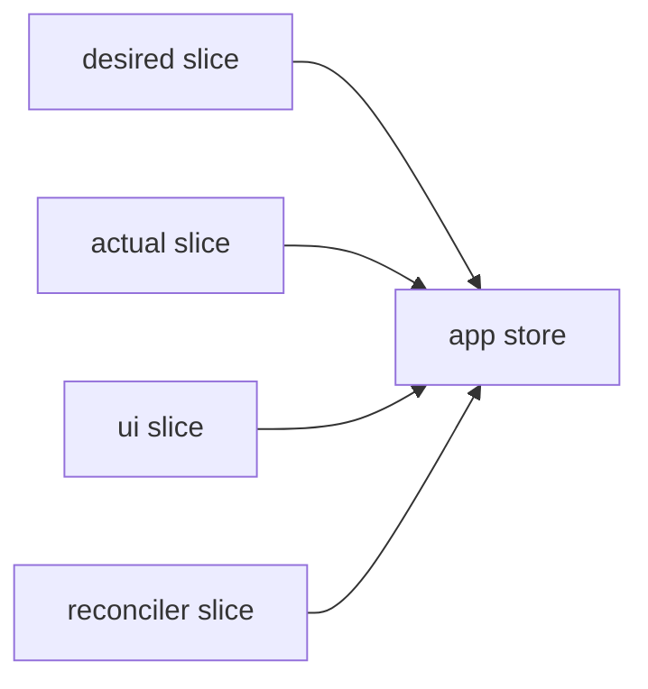

# State Management Options Matrix

## Decision Context
Need a lightweight solution that:
- Keeps presentational components props-only.
- Supports both `desiredState` and `actualState`.
- Scales into reconciliation/event-log work already planned in `docs/architecture.md`.

## Shortlist
- Zustand
- Jotai
- React Context + `useReducer`

## Comparison
| Option | Bundle/Complexity | Ergonomics | Performance Profile | Fit For This Repo | Notes |
|---|---|---|---|---|---|
| Zustand | Low | Very simple action store model | Good selector-based subscriptions | Strong | Closest to Redux-like mental model without Redux overhead |
| Jotai | Low | Atomic and flexible | Very good fine-grained updates | Strong | Better when state decomposition becomes very granular |
| Context + useReducer | Very low deps | Familiar but can get verbose | Can cause broader re-renders without care | Medium | Good for tiny apps, but may strain as reconciliation features grow |

## Recommendation
Use `Zustand` first.

Why:
- Minimal API surface for current team velocity.
- Clean action-based updates for desired/actual flows.
- Easy migration from route-level `useState`.
- Good support for selector subscriptions as more panels are added.

## Optional Secondary Path
If the state graph becomes highly fragmented and component-local atoms are preferred, move to or combine with Jotai in a later phase.

## Store Slice Proposal


## Suggested Initial Store Contract (Type-Level)
```ts
type AppState = {
  desiredState: Shape[]
  actualState: Shape[]
  selectedActualShapeId?: string
}

type AppActions = {
  selectActualShape: (shapeId?: string) => void
  setActualShapeColor: (shapeId: string, color: string) => void
  deleteActualShape: (shapeId: string) => void
  addDesiredShape: () => void
  removeDesiredShape: (shapeId: string) => void
  updateDesiredShapeType: (shapeId: string, type: ShapeType) => void
  updateDesiredShapeColor: (shapeId: string, color: string) => void
}
```

## Migration Gate
Proceed with Zustand if:
- No hard requirement exists for Redux DevTools time-travel semantics.
- Team prefers simplest setup over strict reducer ceremony.
